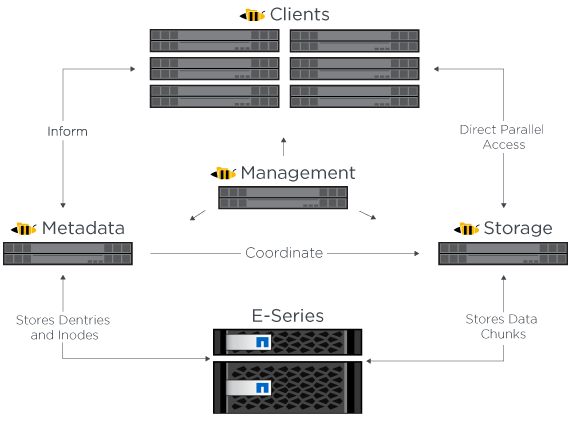

= Überblick über die Architektur
:hardbreaks:
:allow-uri-read: 
:nofooter: 
:icons: font
:linkattrs: 
:imagesdir: ./media/

[role="lead"]
Die BeeGFS on NetApp Lösung beinhaltet Design-Aspekte, die bei der Architekturentwicklung berücksichtigt werden, um die spezifischen Geräte, Kabel und Konfigurationen zu ermitteln, die für validierte Workloads erforderlich sind.

== Modulare Architektur

Das BeeGFS-Dateisystem kann je nach Storage-Anforderungen unterschiedlich implementiert und skaliert werden. In Anwendungsfällen, die in erster Linie mehrere kleine Dateien enthalten, profitieren beispielsweise von der zusätzlichen Performance und Kapazität der Metadaten, während in Anwendungsfällen mit weniger großen Dateien mehr Storage-Kapazität und Performance für die tatsächlichen Dateiinhalte erforderlich wären. Diese verschiedenen Überlegungen wirken sich auf die verschiedenen Dimensionen der Implementierung paralleler Dateisysteme aus, was die Entwicklung und Implementierung des Filesystems weiter vereinfacht.

Zur Bewältigung dieser Herausforderungen hat NetApp eine standardmäßige Bausteinarchitektur entwickelt, mit der sich jede dieser Dimensionen skalieren lässt. BeeGFS-Bausteine werden in der Regel in einem von drei Konfigurationsprofilen bereitgestellt:

* Ein einzelner Baustein, einschließlich BeeGFS-Management, Metadaten und Storage-Services
* Ein BeeGFS Metadaten plus Storage-Baustein
* Ein BeeGFS-Lagergebäude

Die einzige Hardware-Änderung zwischen diesen drei Optionen ist die Verwendung kleinerer Laufwerke für BeeGFS-Metadaten. Andernfalls werden alle Konfigurationsänderungen durch die Software übernommen. Und mit Ansible als Implementierungs-Engine gestaltet sich die Einrichtung des gewünschten Profils für einen bestimmten Baustein die Konfigurationsaufgaben unkompliziert.

Weitere Informationen finden Sie unter <<Verifiziertes Hardwaredesign>>.

== File-System-Services

Das BeeGFS-Dateisystem umfasst die folgenden Hauptdienste:

* *Management Service.* registriert und überwacht alle anderen Dienste.
* *Speicherdienst.* speichert den verteilten Inhalt der Benutzerdatei, bekannt als Datenblock-Dateien.
* *Metadatendienst.* verfolgt das Dateisystem-Layout, Verzeichnis, Dateiattribute und so weiter.
* *Client Service.* installiert das Dateisystem, um auf die gespeicherten Daten zuzugreifen.

Die folgende Abbildung zeigt die Komponenten und Beziehungen der BeeGFS-Lösung für NetApp E-Series Systeme.

Als paralleles Dateisystem verteilt BeeGFS seine Dateien auf mehrere Server-Nodes, um die Lese-/Schreib-Performance und Skalierbarkeit zu maximieren. Die Server-Knoten arbeiten zusammen, um ein einziges Dateisystem bereitzustellen, das gleichzeitig von anderen Server-Knoten, allgemein bekannt als _Clients_, gemountet werden kann. Diese Clients können das verteilte Dateisystem auf ähnliche Weise wie ein lokales Dateisystem wie NTFS, XFS oder ext4 sehen und nutzen.

Die vier wichtigsten Services werden in einer Vielzahl von unterstützten Linux Distributionen ausgeführt und kommunizieren über jedes TCP/IP- oder RDMA-fähige Netzwerk, einschließlich InfiniBand (IB), Omni-Path (OPA) und RDMA over Converged Ethernet (RoCE). Die BeeGFS Server Services (Management, Speicherung und Metadaten) sind Benutzerspace-Dämonen, während der Client ein natives Kernel-Modul (patchless) ist. Alle Komponenten können ohne Neustart installiert oder aktualisiert werden. Sie können beliebige Kombinationen von Services auf demselben Node ausführen.

== HA-Architektur

BeeGFS auf NetApp erweitert die Funktionalität der BeeGFS Enterprise Edition durch Entwicklung einer vollständig integrierten Lösung mit NetApp Hardware, die eine HA-Architektur (Shared Disk High Availability, Shared-Hochverfügbarkeit) ermöglicht.

NOTE: Die BeeGFS Community Edition kann zwar kostenlos genutzt werden, jedoch muss bei der Enterprise Edition ein Professional Support-Abonnementvertrag von einem Partner wie NetApp abgeschlossen werden. Die Enterprise-Version ermöglicht die Nutzung mehrerer zusätzlicher Funktionen wie Ausfallsicherheit, Kontingentzuverfolgung und Storage-Pools.

In der folgenden Abbildung werden die HA-Architekturen ohne Shared-Festplatten verglichen.

image:../media/beegfs-design-image1.png[""]

Weitere Informationen finden Sie unter https://www.netapp.com/blog/high-availability-beegfs/["Ankündigung der Hochverfügbarkeit für BeeGFS mit Unterstützung von NetApp"^].

== Verifizierte Nodes

Die BeeGFS auf NetApp-Lösung hat die unten aufgeführten Knoten verifiziert.

[cols="10%,20%,70%"]
|===
| Knoten | Trennt | Details 

| Block-Storage | NetApp EF600 Storage-System | Dieses rein NVMe-basierte 2-HE-Storage-Array mit hoher Performance ist für anspruchsvolle Workloads konzipiert. 

.2+| Datei | Lenovo ThinkSystem SR665 V3-Server | 2-Socket-Server mit PCIe 5.0, zwei AMD EPYC 9124 Prozessoren. Weitere Informationen zum Lenovo SR665 V3 finden Sie unter https://lenovopress.lenovo.com/lp1608-thinksystem-sr665-v3-server["Lenovo Website"^]. 

| Lenovo ThinkSystem SR665 Server | 2-Socket-Server mit PCIe 4.0, zwei AMD EPYC 7003 Prozessoren. Weitere Informationen zum Lenovo SR665 finden Sie unter https://lenovopress.lenovo.com/lp1269-thinksystem-sr665-server["Lenovo Website"^]. 
|===

== Verifiziertes Hardwaredesign

Die Bausteine der Lösung (in der folgenden Abbildung dargestellt) verwenden die verifizierten File-Node-Server für die BeeGFS-Dateiebene und zwei EF600-Storage-Systeme als Block-Ebene.

image:../media/beegfs-design-image2-small.png[""]

Die BeeGFS on NetApp Lösung läuft über alle Bausteine während der Implementierung hinweg. Auf dem ersten implementierten Baustein müssen BeeGFS-Management-, Metadaten- und Storage-Services (als Basisbaustein bezeichnet) ausgeführt werden. Alle nachfolgenden Bausteine können über Software konfiguriert werden, um Metadaten und Storage-Services zu erweitern oder ausschließlich Storage-Services bereitzustellen. Mit diesem modularen Ansatz kann das Filesystem an die Anforderungen eines Workloads skaliert werden, während gleichzeitig dieselben zugrunde liegenden Hardware-Plattformen und dasselbe Bausteindesign verwendet werden.

Bis zu fünf Bausteine können als Standalone Linux HA-Cluster implementiert werden. Dies optimiert die Ressourcenverwaltung mit Pacemaker und sorgt für eine effiziente Synchronisierung mit Corosync. Mindestens ein dieser Standalone BeeGFS HA-Cluster wird kombiniert, um ein BeeGFS-Filesystem zu erstellen, das für Clients als einzelner Storage-Namespace zur Verfügung steht. Auf der Hardware-Seite kann ein einzelnes 42-HE-Rack bis zu fünf Bausteine zusammen mit zwei 1-HE-InfiniBand-Switches für das Storage-/Datennetzwerk aufnehmen. Eine visuelle Darstellung finden Sie in der folgenden Grafik.

NOTE: Zum Herstellen von Quorum im Failover Cluster sind mindestens zwei Bausteine erforderlich. Ein Cluster mit zwei Nodes hat Einschränkungen, die ein erfolgreiches Failover verhindern können. Wenn Sie ein Cluster mit zwei Nodes konfigurieren, wird ein drittes Gerät als Tiebreaker integriert, dieses Design wird jedoch nicht in dieser Dokumentation beschrieben.

image:../media/beegfs-design-image3.png[""]

== Ansible

BeeGFS auf NetApp wird mittels Ansible-Automatisierung bereitgestellt und implementiert. Das Hosting wird auf GitHub und Ansible Galaxy (die BeeGFS-Sammlung ist über verfügbar https://galaxy.ansible.com/netapp_eseries/beegfs["Ansible-Galaxie"^] Und https://github.com/netappeseries/beegfs/["NetApp E-Series GitHub"^]). Obwohl Ansible vor allem mit der Hardware getestet wird, die zum Zusammenbauen der BeeGFS-Bausteine verwendet wird, können Sie es so konfigurieren, dass es auf nahezu jedem x86-basierten Server unter Verwendung einer unterstützten Linux-Distribution ausgeführt wird.

Weitere Informationen finden Sie unter https://www.netapp.com/blog/deploying-beegfs-eseries/["Implementieren von BeeGFS mit E-Series Storage"^].
